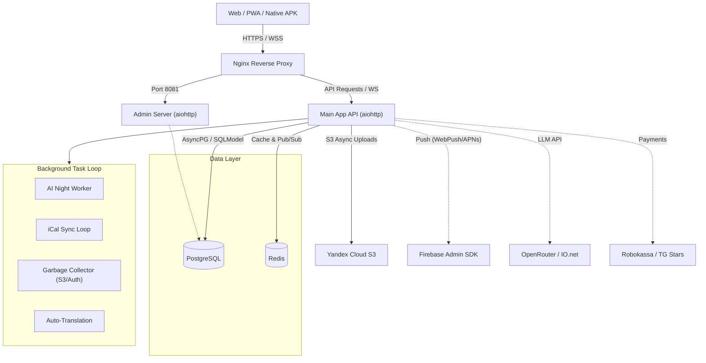
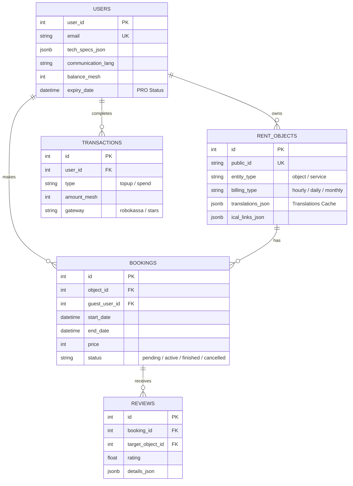

# 🏠 MeshRent — Premium SaaS Rental Platform & Marketplace

**MeshRent** (Mesh) — это независимая глобальная SaaS-платформа и маркетплейс для управления и поиска аренды (недвижимость, транспорт, вещи, услуги). Проект объединяет в себе мощную CRM-систему для владельцев (Hosts) и удобную витрину с умным поиском для клиентов (Guests).

> 🔒 **Примечание:** Данный репозиторий представляет собой **архитектурный концепт** и содержит выдержки из кодовой базы. Полный исходный код является закрытым коммерческим продуктом. Готов продемонстрировать исходники, DevOps-инфраструктуру и процессы деплоя на техническом интервью.

🚀 **Production / Рабочий проект:** [meshrent.com](https://meshrent.com) (Полноценный релиз: открывается в браузере или устанавливается как PWA)

---

## 🎯 Продуктовое видение (Product Vision)
Цель проекта — предоставить универсальную и быструю систему для шеринговой экономики, не уступающую нативным приложениям по скорости и UX. Проект спроектирован как продвинутое PWA-решение с единой кодовой базой для Web, устанавливаемых приложений и сборки под iOS/Android через Capacitor.

**Ключевые продуктовые фичи:**
- **Zero-Flicker UX & Smart Render:** Мгновенный рендеринг интерфейса. Данные моментально отрисовываются из локального кэша, а затем *бесшовно* и "тихо" обновляются из фона без морганий (Skeletons используются только при "холодном старте").
- **AI-Ассистент и Оркестрация LLM:** Встроенный нейросетевой бизнес-радар для владельцев (генерация утренних сводок, анализ логистики, расчет цен, автоответы на отзывы) и NLP-парсер для умного поиска гостями.
- **Глобальная локализация:** Бесшовная мультивалютность с автоконвертацией по актуальным курсам и фоновый поточный перевод карточек объектов на лету (Google Translate API).
- **Интеграция и Синхронизация (iCal):** Двусторонний обмен календарями с Airbnb, Booking, Avito, Суточно.ру и другими площадками для предотвращения овербукинга.
- **Умные Договоры:** Автоматическая генерация и предзаполнение договоров аренды (HTML/PDF) на основе данных владельца и гостя.

---

## 🏗 Архитектура системы (System Architecture)

Система построена на базе асинхронного ядра **Python (AsyncIO + aiohttp)**. Все I/O операции строго неблокирующие. Разделение бизнес-логики реализовано через изолированные процессы (API, Admin, Background Workers), общающиеся через **Redis Pub/Sub**.

---

## 🗄 Схема Базы Данных (E-R Diagram)

База данных спроектирована в **PostgreSQL**. Активно используются поля `JSONB` для хранения кэша переводов, сложных настроек объектов, AI-отчетов и метаданных аналитики. ORM: **SQLModel**.

---

## 🚀 Ключевые технические решения (Engineering Highlights)

### 1. Архитектура Frontend: DOM vs Network Chunking (Vanilla JS)
Плавность работы со списками достигается за счет двойной пагинации:
- **Network Chunking:** Данные запрашиваются с бэкенда большими пакетами (по 50 элементов), ответы сжимаются с помощью прозрачного GZIP.
- **DOM Chunking (Lazy Rendering):** Для предотвращения фризов `Main Thread` в DOM элементы рендерятся малыми "чанками" (по 20 шт) по мере скролла пользователя (отслеживание через `requestAnimationFrame`).

### 2. Resilient AI Orchestration & AST Fallback
- Мульти-провайдерная логика LLM (переключение между IO.net и OpenRouter). В случае получения HTTP 429 от провайдера, ключ мгновенно уходит в `Redis Cooldown`, и запрос бесшовно передается на следующий ключ/модель.
- **AST Recovery:** Поскольку нейросети периодически возвращают "грязный" JSON (с Markdown-тегами или одинарными кавычками), реализован интеллектуальный парсер с фоллбэком на `ast.literal_eval` Python для гарантированного восстановления бизнес-данных.

### 3. Картографический движок (MapLibre GL JS)
- Использование MapLibre 5.x с поддержкой аппаратного ускорения (WebGL) и 3D Глобуса. 
- Динамическая кластеризация маркеров на клиенте и расчет дистанции (Haversine formula).
- Интеграция процедурных эффектов (Огни городов ночью, Звездное небо, Атмосфера), зависящих от `pitch` и `zoom` камеры.

### 4. Zero Trust & Anti-Spam Security
- Проверка авторизации на уровне кастомных aiohttp Middlewares. На клиенте состояние визуально оптимистично, но сервер валидирует все изменения данных.
- Подтверждения по Email через временные коды (OTP), хранящиеся в БД с жестким лимитом попыток (`brute-force protection`).
- Все I/O (Загрузка в S3 бакет) использует валидацию `Magic Bytes`, отсекая исполняемые файлы до этапа обработки.

### 5. Unified Notification Protocol & DND
- Единый интерфейс пуш-уведомлений через **Firebase Cloud Messaging**.
- **Серверный Do Not Disturb (DND):** Бэкенд автоматически вычисляет локальное время пользователя с помощью `pytz`. Если пользователь спит, стандартный алерт понижается до "Тихого пуша" (`silent=True`), обновляющего локальную IndexedDB без звука и вибрации.

---

## 🛠 Стек технологий (Tech Stack)

**Backend:**
* `Python 3.12`, `AsyncIO`
* `Aiohttp` (Web Server, Middlewares, WebSockets)
* `PostgreSQL` + `asyncpg` + `SQLModel`
* `Redis` (Pub/Sub & Rate Limiting ZSET)
* `OpenRouter API` / `IO.net API` (AI LLMs: LLaMA 3, Qwen, DeepSeek)

**Frontend / Mobile:**
* `Vanilla JavaScript` (ES6+), `HTML5`, `CSS3`
* `MapLibre GL JS 5.24.0` (Map Engine & 3D Globe)
* `Chart.js` (Analytics visualization)
* `Service Workers` & `IndexedDB` (PWA Offline First)
* `Capacitor` (Сборка Native iOS/Android App)

**Infrastructure / Integrations:**
* `Docker` & `Docker Compose`
* `Nginx`
* `Yandex Cloud S3` (`aioboto3`)
* `Firebase Admin SDK` (Push Notifications / WebPush)
* `Robokassa API` & `Telegram Bot API` (Payments Gateway)

---
*Проект разработан и поддерживается Александром Кузиным.*
